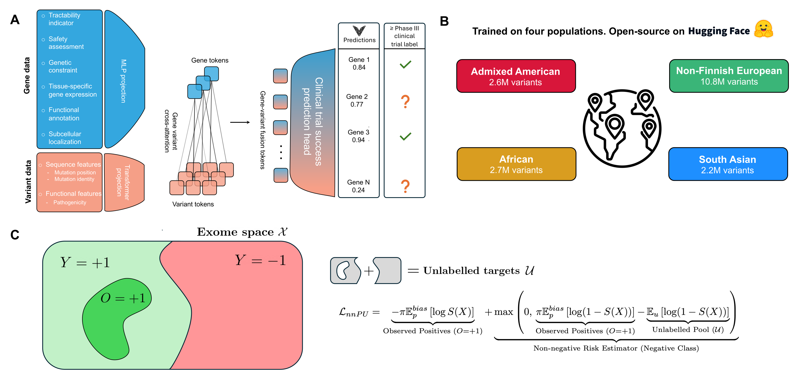

<div align="center">

<picture>
  <source media="(prefers-color-scheme: dark)" srcset="docs/figures/varformer_logo_dark.png">
  
</picture>

# Varformer

**A multimodal transformer to learn population-informed gene representations for drug target ID.**

[](https://www.python.org/downloads/release/python-390/)
[](https://opensource.org/licenses/MIT)
[](https://github.com/aaronwtr/Varformer/actions/workflows/ci.yml)
[](#)
[](#)

</div>

**Varformer** predicts the clinical-trial success of drug targets by combining gene-level biological features with population-scale genetic variation. Instead of collapsing a gene's variants into summary statistics, a cross-modal attention mechanism learns directly from the raw, variable-length set of missense variants observed in a population — tackling the label sparsity and population-specific genetic architecture that make target discovery hard.

Trained across four ancestrally diverse populations: African (AFR), Admixed American (AMR), Non-Finnish European (NFE), and South Asian (SAS, via the Genes & Health cohort).

<p align="center">
  
</p>

## Installation

```bash
git clone https://github.com/aaronwtr/Varformer.git
cd Varformer
uv sync          # or: pip install -e .
```

Requires Python 3.9 and a CUDA-capable GPU for inference at scale (CPU works for small batches).

## Inference on a published population

```python
from varformer import Varformer

# Load the best-scoring checkpoint for a population.
model = Varformer.from_pretrained("nfe", seed="best")

# Score a list of Ensembl gene IDs for clinical-trial success.
predictions = model.predict(
    genes=["ENSG00000141510", "ENSG00000139618"],
    return_attention=False,
)
for gene_id, payload in predictions.items():
    print(gene_id, payload["prediction"], payload["classification"])
```

Each `payload` dict contains:

- `prediction` — the model's sigmoid score for clinical-trial success in `[0, 1]`.
- `classification` — binary 0/1 from the trained decision threshold.
- `z_var` — the variant-informed gene embedding (NumPy array).
- `attn_weights` — per-variant attention scores (only when `return_attention=True`).

The `seed` argument accepts an integer (load that specific seed) or `"best"` (pick the highest-scoring checkpoint by `val_spearman`).

### Available checkpoints

| Code label | Cohort |
|---|---|
| `nfe` | Non-Finnish European (gnomAD) |
| `sas` | South Asian — Genes & Health (Bangladeshi + Pakistani), N=44,288 |
| `afr` | African (gnomAD) |
| `amr` | Admixed American (gnomAD) |

Trained weights will be released on the Hugging Face Hub alongside the paper — `from_pretrained` will fetch and cache the requested `(population, seed)` on first use. Until then it reads checkpoints from disk at `checkpoints/<label>/seed{N}-epoch=*-val_spearman=*.ckpt`.

## Model

Following the design in the paper, Varformer is structured around two complementary modules whose representations are fused by cross-modal attention before classification:

- **Gene Characterisation (GC) module** — captures gene-centric biology independent of the population. In the implementation this is split across two parallel MLP projections: one over the Open Targets tractability features, and one over Gene Ontology-derived features. Their outputs are concatenated into a single gene-level representation `z_gene`.
- **Population Variant Characterisation (PVC) module** — encodes the variable-length set of missense variants observed in a population for each gene. Each variant is represented by its AlphaMissense pathogenicity score, its protein position, and its mutation-type index. A small transformer encoder (`VariantEncoder`) produces contextualised variant embeddings.

`z_gene` then attends over the per-variant embeddings (`GeneVariantAttention`), producing a single variant-informed embedding `z_var`. The classification head concatenates `z_gene` with `z_var` and predicts a clinical-success score.

**Loss.** Drug-target labels are positive-only — clinical-trial failure is not a reliable negative signal — so Varformer treats the problem as positive-unlabelled (PU) learning. Training optimises the **non-negative risk estimator (nnPU)**, an unbiased classification-risk estimator that does not require explicit negatives. nnPU yields more stable learning than two-step PU methods under the extreme label sparsity that characterises drug-target identification.

## Training on a new exome-seq dataset

To train Varformer on a different population or cohort, the dataset has to be pre-processed into the same per-gene format used by the published populations:

1. **Variants.** A pickle keyed by Ensembl gene ID, where each value is the gene's missense-variant table (columns: AlphaMissense pathogenicity score, protein position, mutation-type index). The mutation-type index is taken from the shared missense map in `data/<pop>/missense_mutation_map.pkl`.
2. **Gene features.** Per-gene Open Targets tractability features and Gene Ontology features, aligned to the same gene index, in the layout expected by `varformer/data/features/gc.py` and `varformer/data/features/go.py`.
3. **Labels.** Positive drug-target labels for PU training; unlabelled genes are inferred automatically.

Register the new population by adding its label to the `Population` literal in `varformer/config.py` and adding its data paths under the appropriate profile in `configs/paths/{local,hpc}.yml`.

Once the data is in place:

```python
from varformer import Varformer

trainer = Varformer.trainer(
    population="<your-label>",
    config_overrides={"epochs": 50, "lr_start": 3e-5},
    output_dir="./checkpoints/",
)
checkpoint_paths = trainer.fit(seeds=[7, 42, 85])
```

`config_overrides` accepts any field from `varformer.config.Hyperparameters`. Each seed produces an independent checkpoint under `output_dir/<your-label>/`.

### Using a different pathogenicity predictor

The variant branch treats pathogenicity as an opaque per-variant scalar (`nn.Linear(1, ...)`), so AlphaMissense is not required when training your own model. You can substitute any missense-pathogenicity predictor by putting its score in the pathogenicity column of the variant table. This is the route for anyone who cannot use AlphaMissense for licensing reasons (it is released under the non-commercial CC BY-NC-SA 4.0) or whose variants fall outside its coverage.

**[ESM-1v](https://github.com/facebookresearch/esm) is the recommended alternative**: it is MIT-licensed (commercial use permitted), computed on demand directly from the protein sequence (so it needs no precomputed table and covers any transcript or organism), and its per-variant log-likelihood ratio drops straight into the scalar slot. Other options include EVE, REVEL, and PolyPhen-2/SIFT.

The only constraint is consistency: the predictor used to train a model must also be used at inference time, because pathogenicity scores from different predictors are not calibrated to one another. For the same reason, the **published checkpoints require AlphaMissense scores** as they were trained on them, so feeding a different predictor's scores to a released model produces out-of-distribution inputs and unreliable predictions.

## Repository layout

```
varformer/         # the importable package
  models/          # VariantEncoder, GeneVariantAttention, Varformer
  training/        # VarformerLightningModule, training loop, callbacks
  inference/       # predict + evaluate entry points
  data/            # features/, parsers/, datasets, samplers, pipeline, loaders, splits
  baselines/       # logistic-regression and random comparison baselines
  utils/           # seeding, aa_codes
  config.py        # Pydantic Config + Hyperparameters
configs/           # default.yml + paths/{local,hpc}.example.yml
docs/figures/      # README assets
checkpoints/       # trained model checkpoints (gitignored)
```

## Data sources

Varformer is trained on publicly available resources plus the access-controlled Genes & Health cohort. Users replicating or extending training need to obtain these datasets directly from their providers under the providers' respective terms.

| Source | Role in Varformer | Access |
|---|---|---|
| [Open Targets](https://platform.opentargets.org/) | GC module — tractability features | Open, [terms](https://platform-docs.opentargets.org/terms-of-use) |
| [Gene Ontology](https://geneontology.org/) | GC module — GO-derived features | Open, [CC BY 4.0](https://geneontology.org/docs/go-citation-policy/) |
| [AlphaMissense](https://www.science.org/doi/10.1126/science.adg7492) | PVC module — per-variant pathogenicity score | Released under CC BY-NC-SA 4.0 — **non-commercial** |
| [gnomAD v4.1](https://gnomad.broadinstitute.org/) | Population variant catalogues for NFE / AFR / AMR | Open, [licensing](https://gnomad.broadinstitute.org/policies) |
| [Genes & Health](https://www.genesandhealth.org/) | South Asian (SAS) exome cohort | Access-controlled; apply via the G&H Data Access Committee |

The downstream AlphaMissense licence (CC BY-NC-SA 4.0) limits commercial use of Varformer's per-variant features. If you intend to deploy Varformer in a commercial setting, obtain a separate AlphaMissense licence or substitute another missense-pathogenicity predictor.

## Updates

- **Pending** — Initial public release with the trained NFE, SAS, AFR, and AMR checkpoints on the Hugging Face Hub, coinciding with the paper.

## Acknowledgements

We thank the participants and operational team of the **Genes & Health** study for the South Asian exome data, and the **Open Targets**, **Gene Ontology Consortium**, **gnomAD / Broad Institute**, and **Google DeepMind (AlphaMissense)** teams for making the underlying resources publicly available.

## Citation

```bibtex
@article{wenteler2026varformer,
  title   = {Varformer: a multimodal transformer for population-scale drug target prioritization},
  author  = {Wenteler, Aaron and Neduva, V. and Cabrera, Claudia P. and Wei, W.  and Barnes, Michael R.},
  year    = {2026},
  journal = {TBD},
  url     = {https://github.com/aaronwtr/Varformer}
}
```

## License

MIT — see `LICENSE`. Note that Varformer's per-variant features depend on AlphaMissense scores, which are released under CC BY-NC-SA 4.0; downstream commercial use of the trained model therefore requires a separate AlphaMissense licence.

## Contact

Aaron Wenteler — <aaronwenteler@gmail.com>
